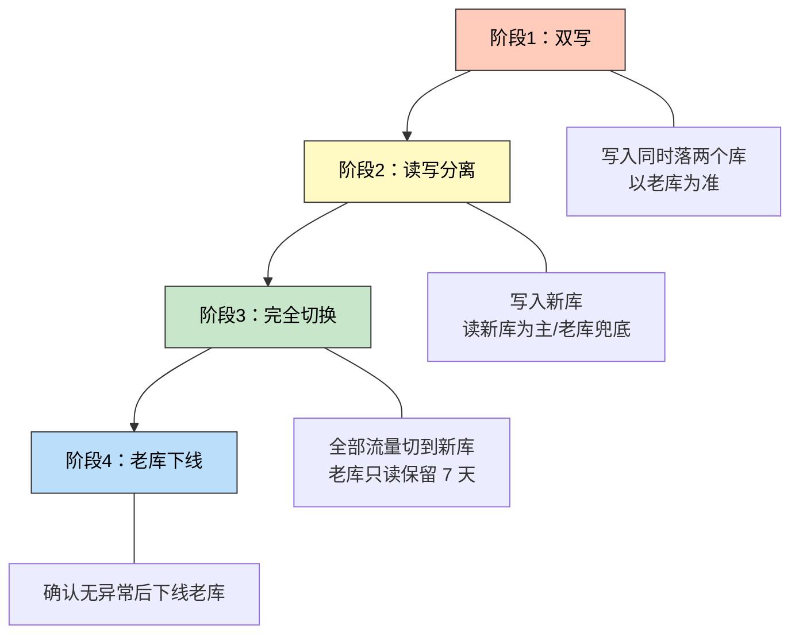

```mermaid
graph TD
    A[阶段1：双写] --> B[阶段2：读写分离]
    B --> C[阶段3：完全切换]
    C --> D[阶段4：老库下线]

    A --- A1[写入同时落两个库<br/>以老库为准]
    B --- B1[写入新库<br/>读新库为主/老库兜底]
    C --- C1[全部流量切到新库<br/>老库只读保留 7 天]
    D --- D1[确认无异常后下线老库]

    style A fill:#ffccbc,stroke:#333,color:#000
    style B fill:#fff9c4,stroke:#333,color:#000
    style C fill:#c8e6c9,stroke:#333,color:#000
    style D fill:#bbdefb,stroke:#333,color:#000
```
