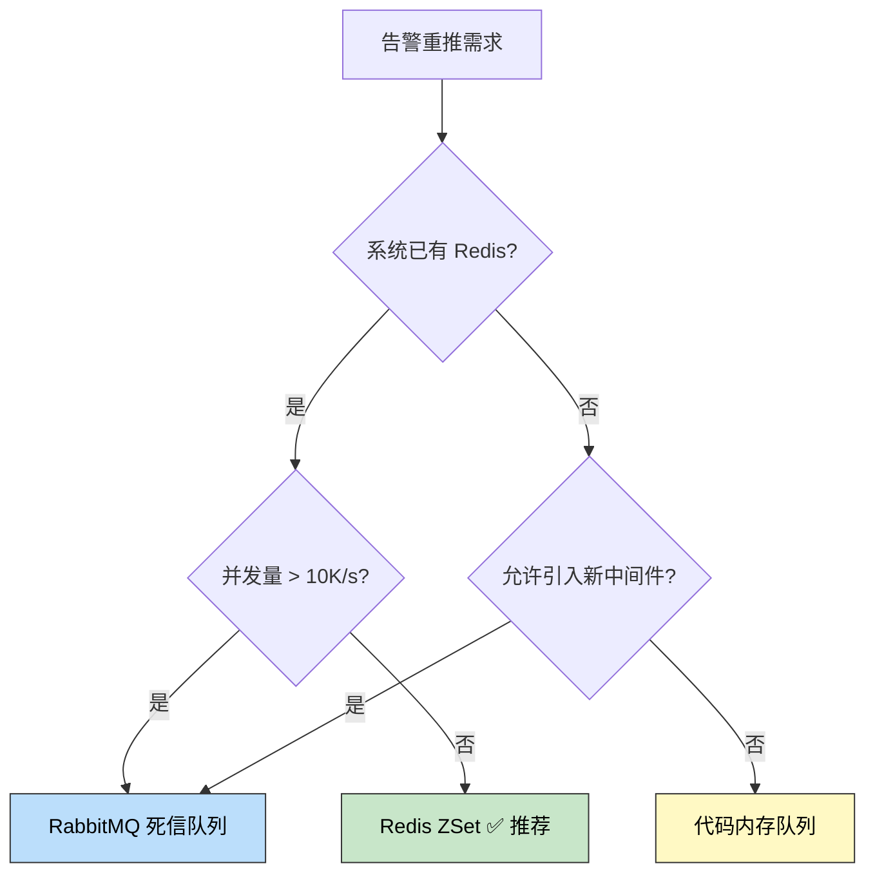

```mermaid
graph TD
    A[告警重推需求] --> B{系统已有 Redis?}
    B -->|是| C{并发量 > 10K/s?}
    B -->|否| D{允许引入新中间件?}
    C -->|是| E[RabbitMQ 死信队列]
    C -->|否| F[Redis ZSet ✅ 推荐]
    D -->|是| E
    D -->|否| G[代码内存队列]

    style F fill:#c8e6c9,stroke:#333,color:#000
    style E fill:#bbdefb,stroke:#333,color:#000
    style G fill:#fff9c4,stroke:#333,color:#000
```
