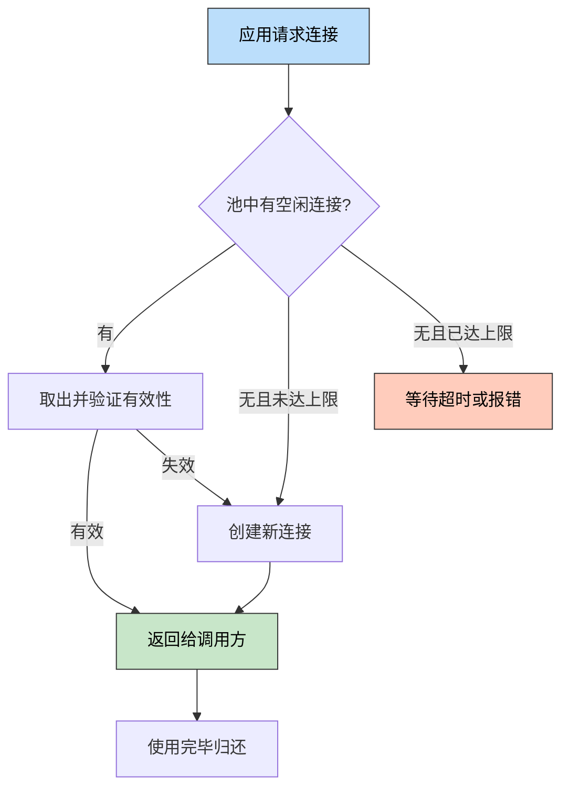

```mermaid
graph TD
    A["应用请求连接"] --> B{"池中有空闲连接?"}
    B -->|"有"| C["取出并验证有效性"]
    B -->|"无且未达上限"| D["创建新连接"]
    B -->|"无且已达上限"| E["等待超时或报错"]
    C -->|"有效"| F["返回给调用方"]
    C -->|"失效"| D
    D --> F
    F --> G["使用完毕归还"]

    style A fill:#bbdefb,stroke:#333,color:#000
    style F fill:#c8e6c9,stroke:#333,color:#000
    style E fill:#ffccbc,stroke:#333,color:#000
```
