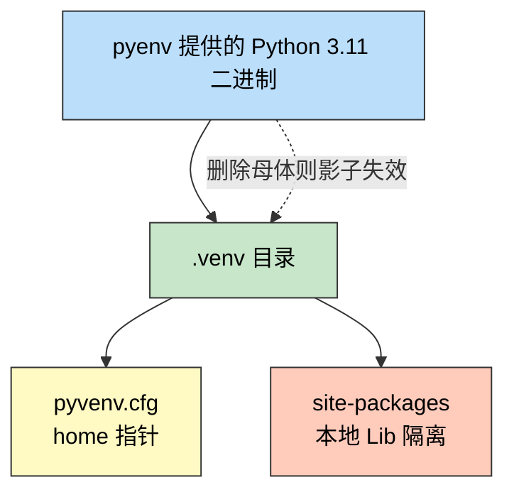

```mermaid
graph TB
    A["pyenv 提供的 Python 3.11 二进制"] --> B[".venv 目录"]
    B --> C["pyvenv.cfg<br/>home 指针"]
    B --> D["site-packages<br/>本地 Lib 隔离"]
    A -. 删除母体则影子失效 .-> B

    style A fill:#bbdefb,stroke:#333,color:#000
    style B fill:#c8e6c9,stroke:#333,color:#000
    style C fill:#fff9c4,stroke:#333,color:#000
    style D fill:#ffccbc,stroke:#333,color:#000
```
