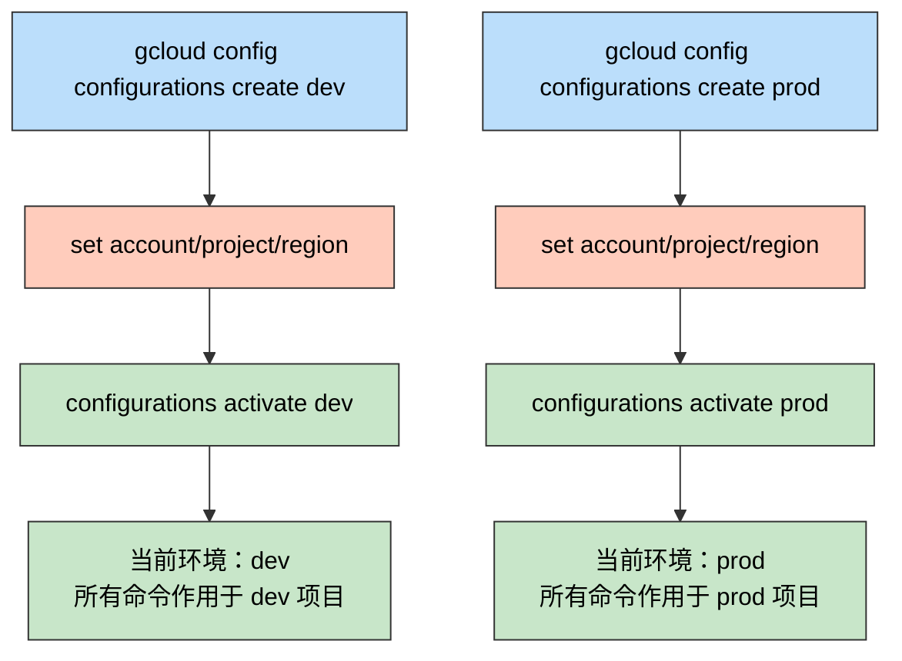

```mermaid
graph TD
    A["gcloud config configurations create dev"] --> B["set account/project/region"]
    C["gcloud config configurations create prod"] --> D["set account/project/region"]
    B --> E["configurations activate dev"]
    D --> F["configurations activate prod"]
    E --> G["当前环境：dev<br/>所有命令作用于 dev 项目"]
    F --> H["当前环境：prod<br/>所有命令作用于 prod 项目"]

    style A fill:#bbdefb,stroke:#333,color:#000
    style C fill:#bbdefb,stroke:#333,color:#000
    style B fill:#ffccbc,stroke:#333,color:#000
    style D fill:#ffccbc,stroke:#333,color:#000
    style E fill:#c8e6c9,stroke:#333,color:#000
    style F fill:#c8e6c9,stroke:#333,color:#000
    style G fill:#c8e6c9,stroke:#333,color:#000
    style H fill:#c8e6c9,stroke:#333,color:#000
```
